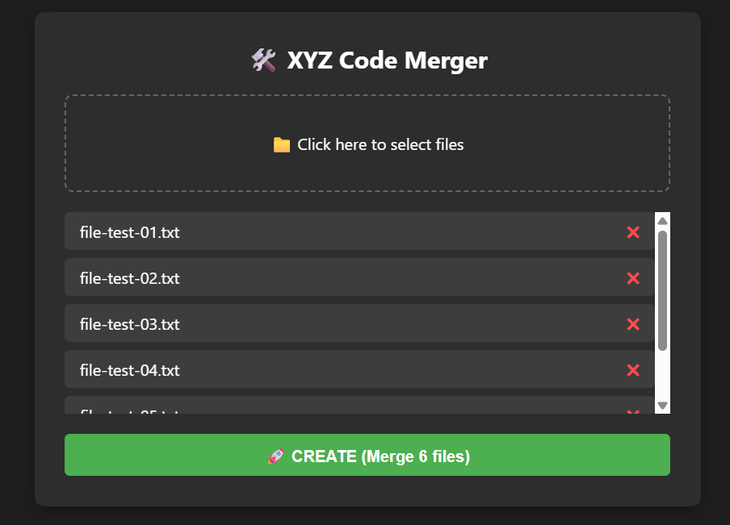

# 🛠️ XYZ Code Merger

Công cụ web siêu nhẹ giúp gộp nhiều file code hoặc tài liệu thành một file `.txt` duy nhất. Đây là giải pháp hoàn hảo và nhanh chóng nhất để vượt qua giới hạn upload 10 file của các AI Chatbot (như Gemini, ChatGPT, Claude) khi bạn muốn cung cấp toàn bộ thư mục dự án cho AI phân tích.

## 💻 Công nghệ & Kiến trúc

- **Vue.js 3 (CDN)**
- **Vanilla HTML/CSS/JS**

## 🚀 Cách sử dụng

Không cần cài đặt bất kỳ môi trường nào!

1. Mở trực tiếp file `index.html` bằng trình duyệt web.
2. Click để chọn (hoặc kéo thả) các file cần gộp.
3. Bấm **CREATE**, đặt tên file xuất ra và mang file `.txt` đó thả vào AI.
